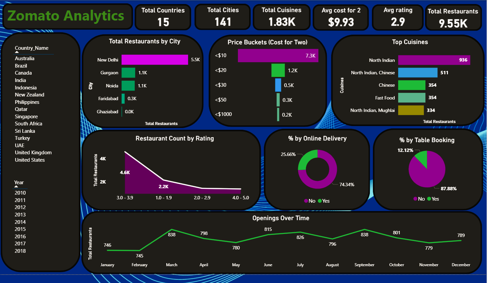
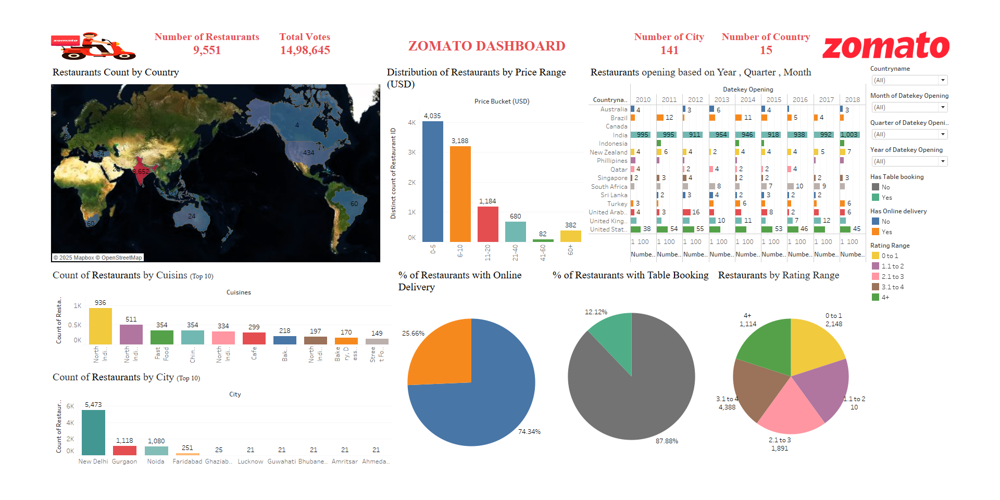
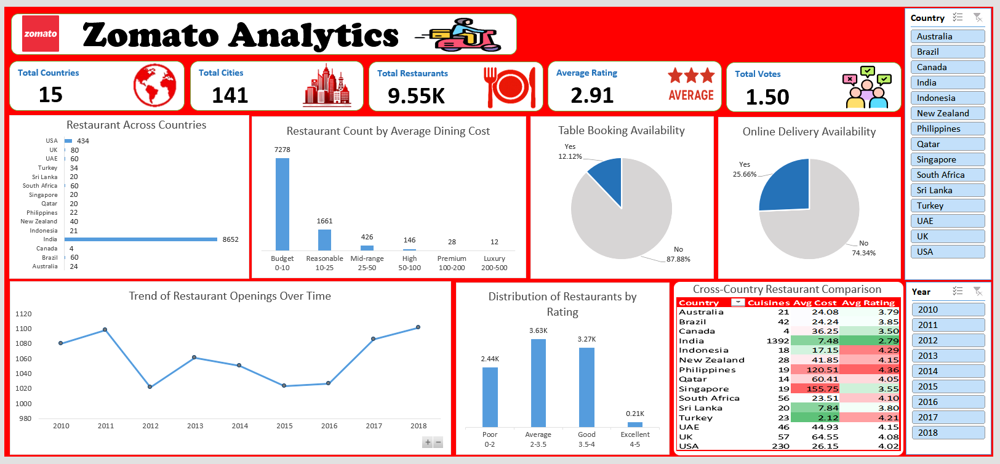

# 🍽️ Zomato Analytics Project
Customer behavior and restaurant performance analytics using Excel, SQL, Tableau &amp; Power BI

This project focuses on analyzing customer behavior, restaurant distribution, pricing trends, and service availability using real-world Zomato data. The analytics were performed using **Excel**, **Power BI**, **Tableau**, and **SQL**, resulting in a comprehensive set of dashboards for strategic decision-making.

---

## 📊 Tools & Technologies Used

- 🟩 **Excel** – Data cleaning, basic visualizations, cost/rating comparison
- 📘 **Power BI** – Interactive dashboards for cities, cuisines, cost buckets, and delivery trends
- 🔵 **Tableau** – Visual storytelling through geographical and categorical dimensions
- 🟡 **SQL** – Structured data querying, transformation, and joining operations

---

## 🧩 Dashboard Gallery

### 📍 Power BI Dashboard

**Key Insights:**
- **Top city**: New Delhi (5.5K restaurants)
- **Most common price bucket**: <$10
- **Most frequent cuisine**: North Indian
- 74% of restaurants support **online delivery**
- Majority of restaurants rated between **3.0–3.9**
- Consistent **restaurant openings** over the year with spikes in February and September

---

### 📍 Tableau Dashboard

**Highlights:**
- Visual map shows **India dominates** with 6,652+ restaurants
- High concentration of restaurants in **price ranges $0–$10 and $10–$20**
- Bar charts highlight cuisine and city-level breakdowns
- Filter by **year, rating range, table booking, online delivery** for deeper insights

---

### 📍 Excel Dashboard

**Insights from Excel Dashboard:**
- **Average rating**: 2.91 (Average)
- High restaurant count in **budget category (0–10 USD)**
- Strong data visualization of **rating distribution**, **opening trends**, and **country-wise summaries**
- Comparative analysis with **conditional formatting** for avg cost and rating across countries

---

## 🧠 Analytical Objectives

- Identify key countries and cities with maximum restaurant presence
- Understand cost patterns for dining across regions
- Analyze service availability (online delivery & table booking)
- Visualize customer engagement based on cuisine and ratings
- Track restaurant growth and trends over time

---

## 📁 Folder Structure

